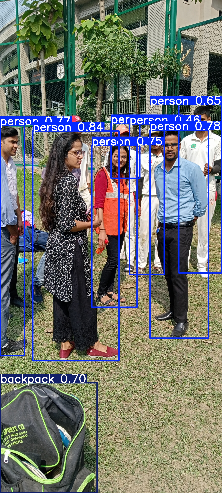

# 🦺 Human Safety Detection using YOLOv11

This project is an **AI-powered object detection system** that helps improve worker safety on construction sites. It detects whether workers are wearing safety gear like **helmets** and **jackets**, and classifies them into four categories:

- 🟢 **Safe** – Wearing both helmet and jacket  
- 🔴 **Unsafe** – Missing one or more safety items  
- ⛑️ **Helmet** – Wearing helmet only  
- 👕 **Jacket** – Wearing jacket only  

The model is trained using a **custom dataset collected and annotated via Roboflow**, and it leverages **YOLOv11** for high-performance real-time detection.

---

## 📸 Example Detections



---

## 🚀 Features

- 📦 Real-time object detection on images and videos  
- 🎯 Custom trained YOLOv11 model with 4 safety-related classes  
- 📊 Evaluation metrics: **Precision**, **Recall**, **mAP50-95**, **mAP50**  
- 🧠 Robust dataset annotated using Roboflow  
- 🎥 Works on both CPU and GPU  

----

## 🧪 Model Evaluation Results

| Metric         | Value  |
|----------------|--------|
| Precision      | 0.906  |
| Recall         | 0.867  |
| mAP50-95(B)    | 0.696  |
| mAP50(B)       | 0.925  |

📊 These results were obtained after training on a custom Roboflow dataset using YOLOv11 for 20 epochs on a 640x640 image size. The model shows strong detection accuracy for safety gear such as helmets and jackets.


---

## 🧰 Tech Stack

- Python
- Ultralytics YOLOv11 (based on YOLOv8)
- Roboflow (for dataset management)
- Jupyter Notebook
- OpenCV (for video support)

---

## 🗂️ Dataset

- Collected and annotated manually via [Roboflow](https://roboflow.com/)
- Categories: `Safe`, `Unsafe`, `Helmet`, `Jacket`
- Images resized to **640x640**
- Format: YOLOv11-compatible
- Downloaded using this link:
  
```bash
curl -L "https://app.roboflow.com/ds/ZRqiPYg7Zt?key=eEtBX3wdBf" > roboflow.zip
unzip roboflow.zip
```

---

## 🏃 How to Run

### 1. Clone the Repo

```bash
git clone https://github.com/Ayush-7747/human-safety-detection
cd human-safety-detection
```

### 2. Install Requirements

```bash
pip install -r requirements.txt
```

### 3. Train the Model (Optional)

```python
from ultralytics import YOLO

model = YOLO("yolov8n.pt")  # or "yolov11n.pt" if available
model.train(data="custom_dataset/custom_data.yaml", epochs=20, imgsz=640)
```

### 4. Run Inference on Image

```python
model = YOLO("runs/detect/train/weights/best.pt")
model.predict(source="test_assets/testimg.jpg", save=True)
```

### 5. Run Inference on Video

```python
model.predict(source="test_assets/testvid.mp4", save=True, conf=0.3)
```

---

## 📂 Folder Structure

```
human-safety-detection/
├── custom_dataset/
│   ├── train/valid/test/
│   └── custom_data.yaml
├── runs/                  # YOLOv11 outputs
├── test_assets/           # Test images/videos
├── models/                # Trained weights
├── README.md
├── requirements.txt
└── .gitignore
```

---

## 📈 Future Work

- ⚡ Real-time webcam detection using OpenCV  
- 🖥️ Flask or Streamlit Web UI  
- 🔔 Alert system when unsafe workers are detected  
- 🧊 ONNX/TensorRT conversion for faster inference  

---

## 🧠 Author

**Ayush Panwar**  
[LinkedIn](https://linkedin.com) • [GitHub](https://github.com/yourusername)

---

## ⭐️ Show Your Support

If you found this project helpful, consider giving it a ⭐ on GitHub or sharing it!
=======
# human-safety-detection
AI-based construction site safety gear detection using YOLOv11
